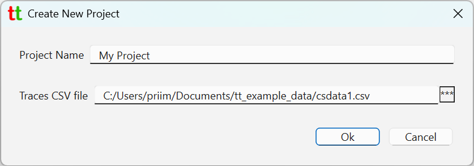

# Basic Usage

## Creating a project

To start _Trace Tool_ application open PowerShell/Terminal window, type `tt` and press `[Enter]`.
When you start it for the very first time no project is opened, and you should see a mostly blank window.

To start tracking and annotating traces from the ChipScope generated csv file you will first need to
create a project by going to menu `File` -> `New Project`.

{: style="height:180px;"}

Give project a name and select csv file with ChipScope generated traces to associate with.

{: style="height:200px;"}

Once created _Trace Tool_ main window should look like so.

In the _Active Traces_ tab you can see all traces loaded from the source csv file.
At the bottom you can see name of the opened project and a csv file that it is tracking.
Farther to the right you can see latest version of the loaded traces. When project is created
a project directory is created and populated with various files including copy of each trace.
This is what allows _Trace Tool_ to keep track of the versions. When csv file is changed,
usually by being overridden by Vivado, _Trace Tool_ can make a new copy of traces into the project
directory while keeping all previous versions.

## Viewing Traces

Double-click on any of the trace to open a window with trace plot.

{: style="height:500px;"}

You can also select multiple traces and the right-mouse click to bring context menu to plot multiple
traces in one window.

{: style="height:300px;"}

{: style="height:500px;"}

## Organizing traces

Not every trace present in the csv file is going to be relevant to your work. You can right mouse click
on any trace to bring up context menu and select option `Mark as inactive`. This will move selected
trace to _Inactive Traces_ tab.

{: style="height:300px;"}

This trace will then be removed from _Active Traces_ tab and be moved into _Inactive Traces_ one.

{: style="height:300px;"}

There is nothing special about traces in the _Inactive Traces_ tab. You can still plot them
by double-clicking on any trace. It is there simply to help user to organize traces relevant
to their work.

Traces from _Inactive Traces_ tab can be brought back into _Active Trace_ tab by
selecting `Mark as active` from their context menu.

{: style="height:300px;"}

## Trace labels

Traces are identified by their names or labels. Trace name is column name in the source csv file and 
cannot be changed by the user. Trace label is another string identifying trace and it can be changed by the user.
_Active Traces_ and _Inactive Traces_ tabs shows trace labels which at the beginning when project is created 
are the same as trace names. To change trace label right mouse click on any trace and click on `Rename trace label`.

{: style="height:300px;"}

This will open a dialog allowing you change trace label.

## Reloading trace data on source csv file change

By default, _Trace Tool_ will watch csv file in the opened project for changes and prompt user to reload traces 
from changed source csv file. 

{: style="height:150px;"}

This can be changed by going to `File` -> `Settings` menu and 
toggling "_Watch source files (csv) for changes and notify user._" checkbox.

{: style="height:155px;"}

If you accept to reload traces new version trace data will be copied into the project and int the right lower corner 
of the main window you will see that latest version changes from `#1` to `#2`.

{: style="height:100px;"}

If you disable source file watch in the settings you can explicitly request to reload traces by going to 
menu `File` -> `Reload traces from source`.

## Plotting latest and previous trace version

When project tracks more than one version of the trace you can request to plot latest and previous version of the trace
by going to the trace context menu and selecting `Plot latest and previous version of the trace`.

{: style="height:210px;"}

This should open plot window that has both trace versions and their versions listed in the right upper corner.

{: style="height:500px;"}

## Changing time step

Source csv file typically will not contain any information about sampling rate (i.e. time step). Thus, by default when 
project is created time step it automatically set to 1 ms. You can change that by going to the _Project_ tab and 
clicking on `Change Value` button for implied time step.

{: style="height:320px;"}

Often you will know sampling rate instead. In that case you can click on `Derive From Sampling Frequency`.

{: style="height:220px;"}

