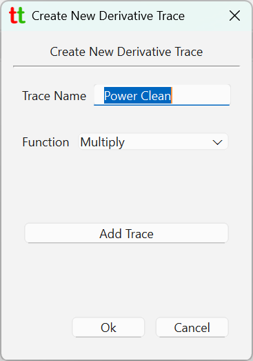
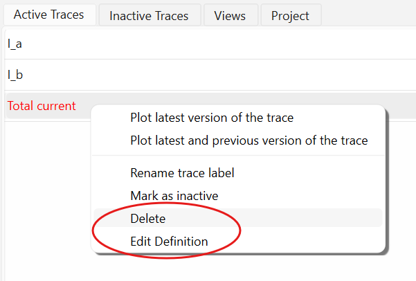
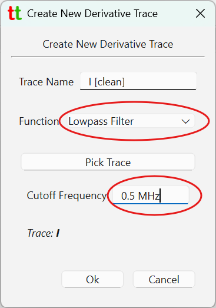

# Derivative Traces

Many of the traces reported by the ChipScope will not be really independent but connected in some way. 
For example one trace might be voltage and another one current. Naturally multiplying these two will 
give value of Power. Sum of traces could refer to sum of group of currents of voltages on voltage divider.
Difference could refer to error deviation from some ideal value and so on.

Derivative trace allows you to create a trace that is an application of function to other "real" traces.
To create a derivative trace go to menu `File` -> `Create Derivative Trace`. This will open a dialog that 
allows one to create a new derivative trace.

{: style="height:350px;"}

In the tabs showing traces
derivative trace will appear in red color and unlike normal traces they can be deleted or modified.

{: style="height:250px;"}

Traces can be derived using following functions: 

* _Add_ and _Multiply_ that take 2 or more traces.
* _Divide_ and _Subtract_ that take exactly two traces.
* _Lowpass Filter_ which takes exactly one source trace. 

Note that dividing two traces might fail if divisor is 0 at any point in the trace and so such trace might not 
be plottable.

Derivative traces can themselves be used as source traces for new derivative traces. This makes sense for example 
if you traces `I [out]` and `V [out]` which are noisy, and you want to plot power based on these two traces to which 
lowpass filter has been applied. To that end, for example, you create two derivative traces `I [clean]` 
and `V [clean]` with lowpass filter applied with cutoff frequency 0.5 MHz. And then create derivative 
trace `Power [clean]` which is a _`I [clean]` * `V [clean]`_.

## Lowpass Filter

When specifying lowpass filter you must provide cutoff frequency with physical unit such as MHz, KHz and so on.

{: style="height:350px;"}

