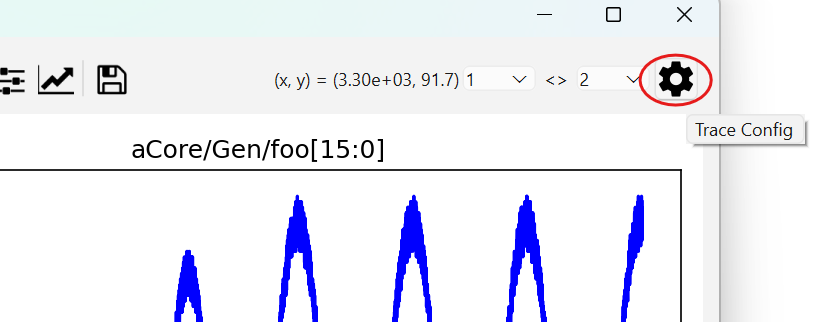
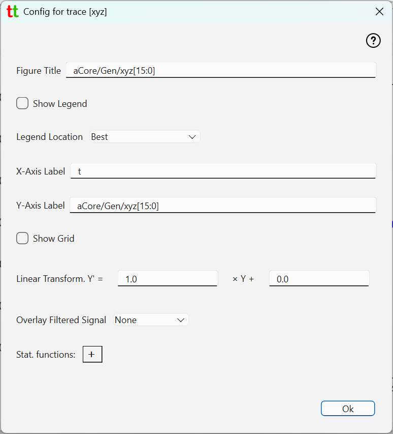
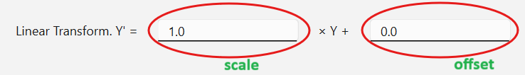
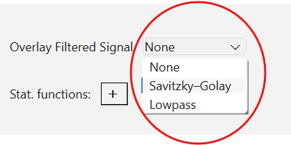
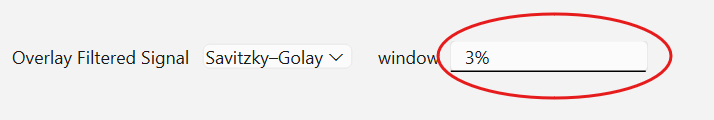
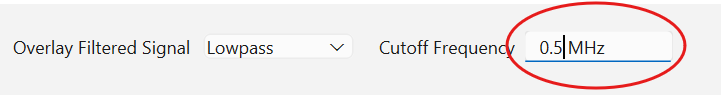
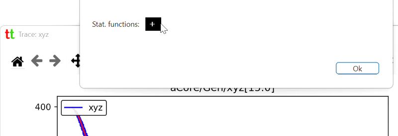

# Trace Settings

Default appearance of trace plots is useful but basic. You can modify what and how trace is plotted by clicking 
on `Trace Config` icon in trace window.

{: style="height:200px;"}

which opens trace config dialog

{: style="height:600px;"}

## Basic settings

* **Figure title** - text that will appear right above the trace plot </li>
* **Show Legend** - show or no-show legend associated with this trace. If enabled legend text is a trace label 
  optionally followed values of stat. functions (see below). If multiple traces are rendered, then label will 
  also include trace version number.
* **Legend Location** - position in the plot where legend will be placed. Default is "best" which imply automatic legend 
  placement on the plot.
*  **X-Axis Label** - label to be shown on the x-axis. Note that if set, then time unit (as configured in the 
   Project tab) will also be appended to this label.
* **Y-Axis Label** - label to be shown on the y-axis.
* **Show Grid** - is grid to be shown in this plot.

## Linear transform

Trace data will typically be an integer representing fraction of some voltage or current range. Hence, to display 
correct physical value on the y-axis you will need to change scale and offset in linear transform 
function _Y' = scale * Y + offset_, which by default are set to 1 and 0 respectively. 

{: style="height:80px;"}

## Overlay filtered signal

If the trace captures analog signal it will most likely be noisy, and you may want to apply some smoothing filter. 
These new smoothed signal will be overlayed on top of the existing "raw" trace. Two filters are 
available: [Savitsky-Golay](https://en.wikipedia.org/wiki/Savitzky%E2%80%93Golay_filter) and digital lowpass filter using 
[Butterworth](https://en.wikipedia.org/wiki/Butterworth_filter) function.

{: style="height:150px;"}

### Savitsky-Golay filter

If you pick Savitsky-Golay filter, then [savgol](https://docs.scipy.org/doc/scipy/reference/generated/scipy.signal.savgol_filter.html) 
function from `SciPy` library will be used for filtering, with `polyorder` (the order of the polynomial used to 
fit the samples) set to 2 and configurable `window_length` (the length of the filter window). You have two ways to 
set `window_length`.

{: style="height:95px;"}

You can either set it as a percentage of total number of data points (default is 3%) by appending percent sign in 
the window text input field, or you can specify absolute number of datapoints in filter window by simply writing a 
number without percent sign.

### Lowpass filter

If you pick Lowpass filter, then you have to specify cutoff frequency and must provide physical unit (MHz, KHz, etc.) 
for the frequency value in the _Cutoff Frequency_ text input field.

{: style="height:75px;"}

## Stat. functions

Basic statistical functions (_min_, _max_, _range_, _mean_ and _standard deviation_) can be added to be computed 
and displayed with the trace legend. This means that to see them you need to toggle _Show Legend_ checkbox above.

{: style="height:200px;"}
