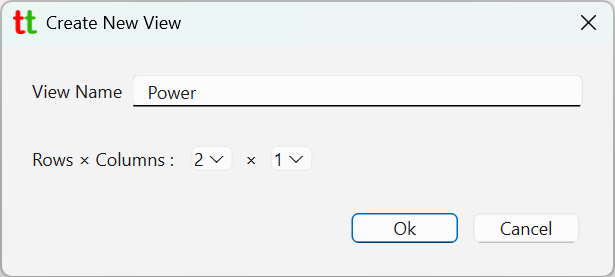
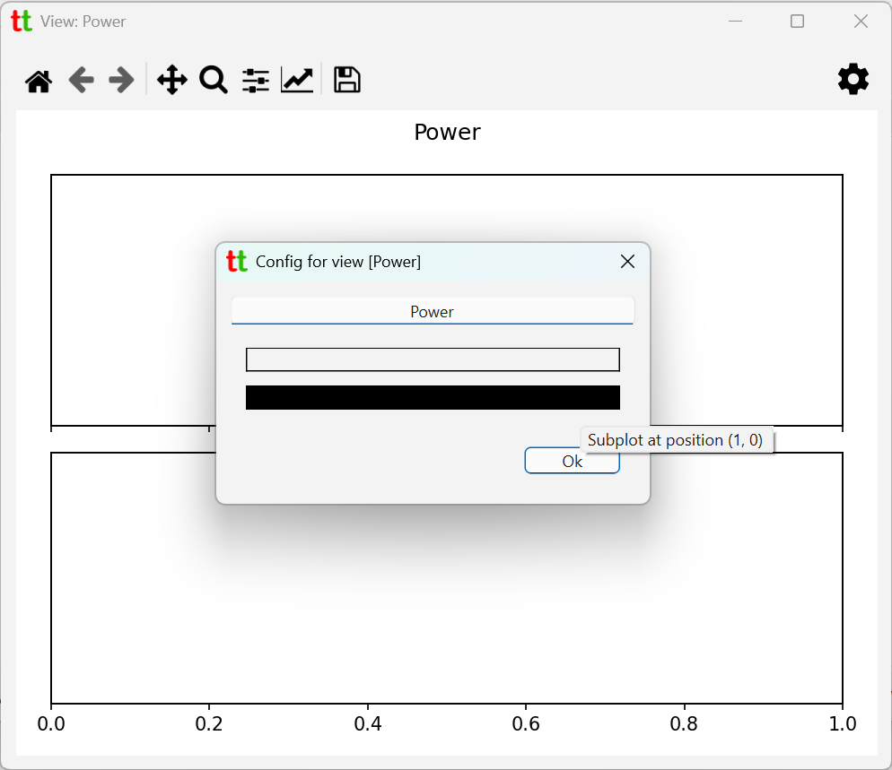
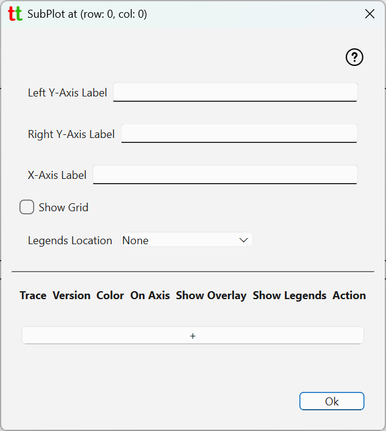
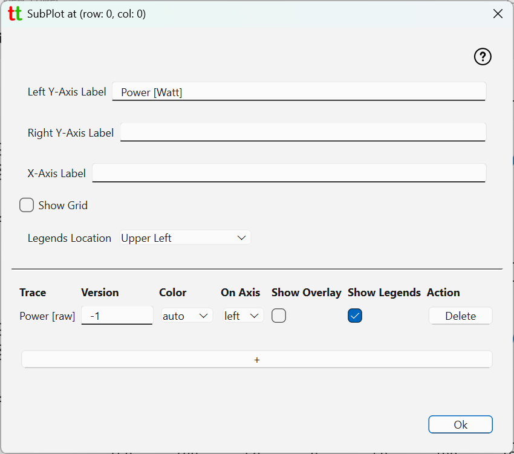
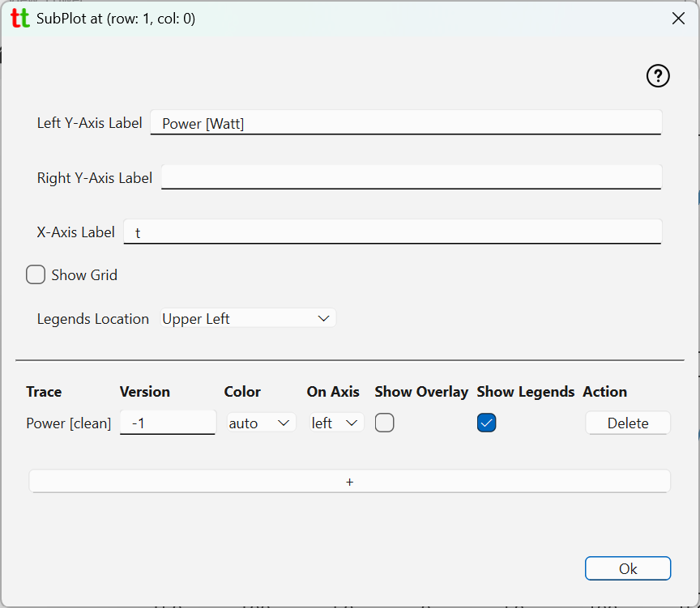
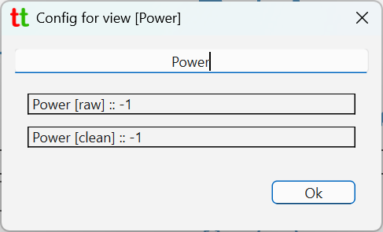
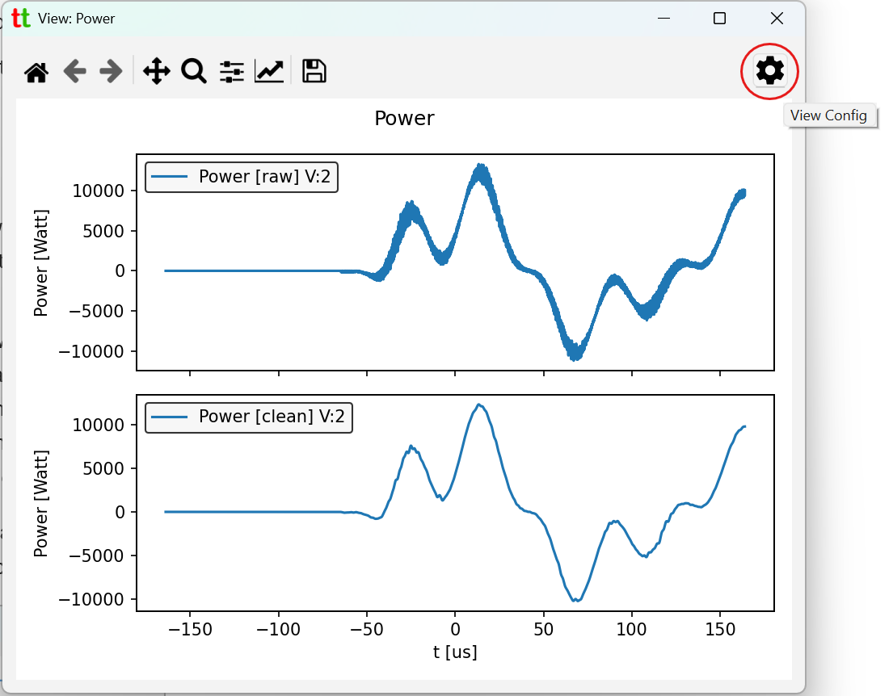

# Views

Views allows user to create plots consisting of multiple subplots arranged in rectangular grid with 
specific traces in each subplot. To create a view go to `File` -> `Create View` which will bring up 
following dialog.

{: style="height:200px;"}

Here we are creating view called `Power` consisting of two subplots each located on their row. 
This will create a view, open it and its config dialog.

{: style="height:500px;"}

At the top you have text dialog containing view title to be displayed in view window and below two 
rectangular boxes representing subplots. You can click on them to bring up subplot configuration dialog.

{: style="height:500px;"}

* **Left Y-Axis Label** - label to be shown on the left y-axis. Note that even if set it will not appear if 
  there are no traces that use left y-axis.
* **Right Y-Axis Label** - label to be shown on the right y-axis. Note that even if set it will not appear 
  if there are no traces that use left y-axis.
* **X-Axis Label** - label to be shown on the x-axis. Note that if set, then time unit (as configured 
  in the Project tab) will also be appended to this label.
* **Show Grid** - is grid to be shown in this subplot.
* **Legends Location** - where to place legends on this subplot if there are any.
  Set to [_None_] if you do not want to legends to be shown at all. Note that even
  if "Legends Location" is set to something which is not [_None_], legends will be shown only if
  there is at least one trace (configured below) that indicates that it is to be accompanied by a legend.

## Adding traces

To add traces to a subplot click on `[ + ]` button at the lower section of the dialog and pick trace that you 
want to add. For example, we will pick trace `Power [raw]` which is a derivative 
trace (multiplication of two unfiltered traces).

{: style="height:500px;"}

And in another subplot we add clean/filtered version of power trace.

{: style="height:500px;"}

For each trace following elements are present

* **Trace** - trace label.
* **Version** - trace version to be shown. -1 always refers to the latest version.
* **Color** - color for this trace. Setting to [_auto_] will ensure no color collisions between multiple traces.
* **On Axis** - _left_ or _right_ axis. Use different axis when you have two traces with wildly different 
  scales on y-axis.
* **Show Overlay** - show or no-show overlay signal if trace is configured to produce one. For example low pass 
  filtered signal. Note that overlay needs to be defined in the config for this trace.
* **Show Legends** - show or no-show legends associated with this trace. Global
  _Legends Location_ value (see above) could suppress overall display of legends for
  this subplot if it is set to [_None_]. Note that if trace is configured to compute basic
  statistics (for example mean or standard deviation values), that statistic will show in the
  legends for the trace. Hence, if you want to see those stat. values you will need to
  enable showing legends.

When subplot settings dialog is closed View config dialog will show which traces and their versions are in each subplot

{: style="height:200px;"}

When you close view config dialog, window displaying the view will be updated. 

You can modify existing view by clicking on `View Config` icon in the right upper corner which will tack you back 
to the view config dialog.

{: style="height:500px;"}

